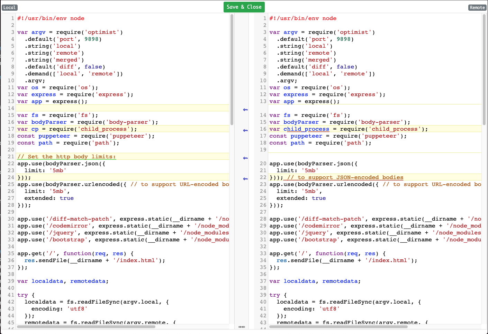

# Mergit
Web based merge tool to use from command line.
Launches your diff or merge view in the browser. 



## Requirements

```
npm 6.13+
npm pkg 
nodejs 12+
```

## Installation

```
git clone https://github.com/amshali/mergit
cd mergit
./pkg.sh

## Based on your system do either of these:
# MacOS
cp bin/macos/mergit /usr/local/bin/
# Linux
cp bin/linux/mergit /usr/local/bin/
```

## How to use?

Edit your `~/.gitconfig`  file and set up as following:

```
[merge]
  tool = mergit
[mergetool "mergit"]
  cmd = mergit --local "$LOCAL" --remote "$REMOTE" --merged "$MERGED"
[mergetool]
  keepBackup = false
```
